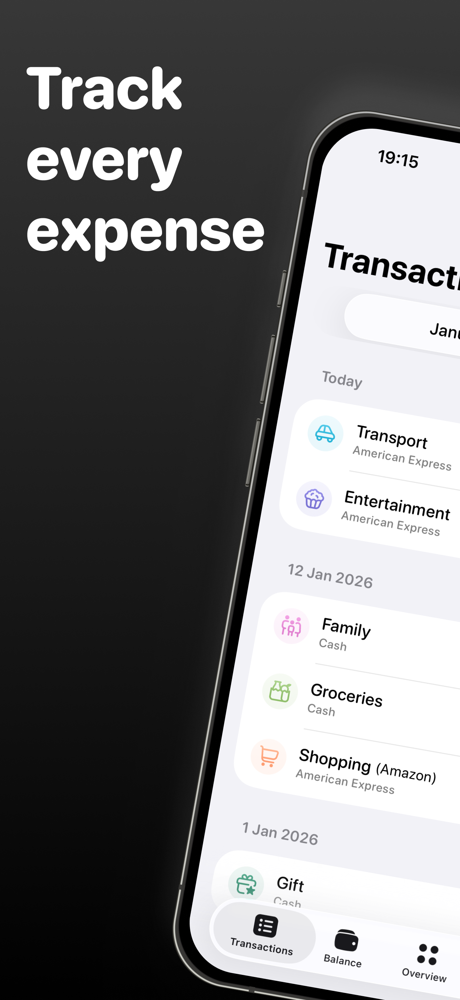
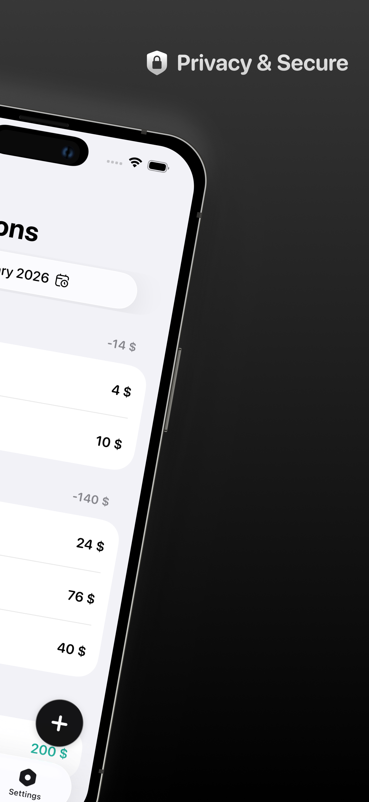
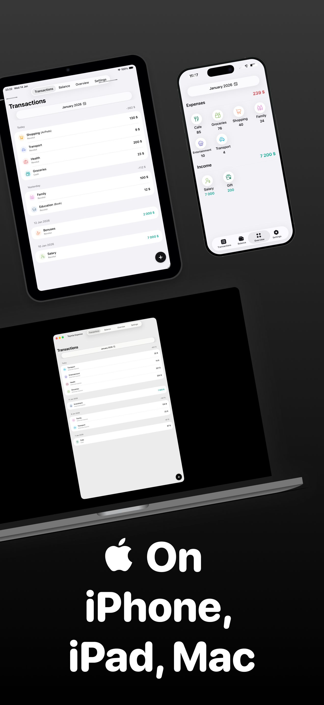
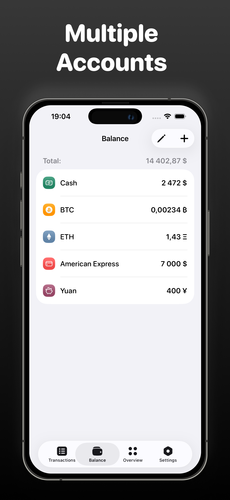
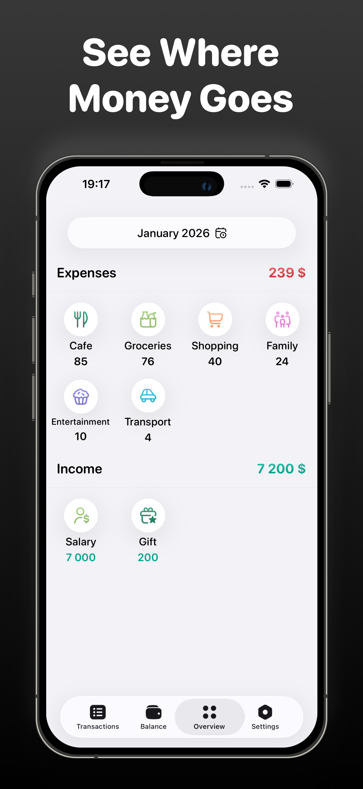
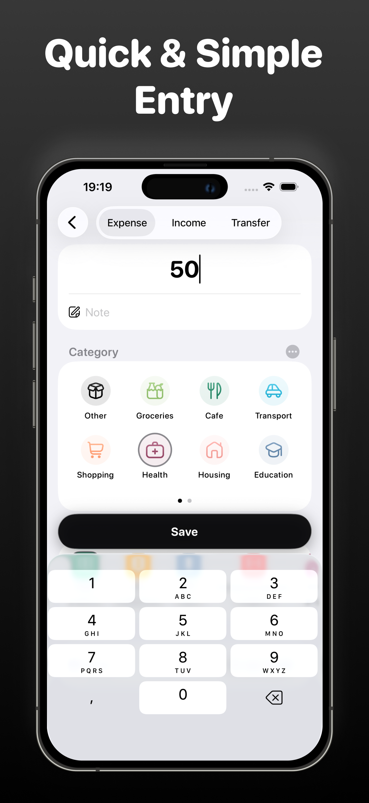

# Teymia Expense

A personal, production-ready expense tracking app for iPhone, iPad and Mac. Built to demonstrate modern Apple platform APIs, clean architecture and a polished user experience — suitable for a product portfolio.

## 📱 Screenshots

<div align="center">
  
  
  
  
</div>

<div align="center">
  
  
</div>

## 🚀 Download

<p align="center">
  <a href="https://apps.apple.com/app/teymia-expense/id6754384037">
    
  </a>
</p>

**⭐ Or build from source using the instructions below!**

## ✨ Features

### Core Features
- **Multiple accounts**: Manage unlimited accounts with different currencies
- **200+ currencies**: Support for both fiat and cryptocurrencies 
- **Categories**: Simple expense and income categorization
- **Transfers**: Track money movement between accounts with balance updates
- **iCloud Sync**: Seamless data synchronization across all your devices
- **Multi-platform**: iPhone, iPad and Mac support 
- **Privacy-first**: All data stored locally and in your personal iCloud

### Financial Precision  
- **Decimal accuracy**: No floating-point errors in calculations
- **Multi-currency**: Each account can use its own currency
- **Auto-detection**: Smart currency selection based on your region
- **Balance tracking**: Real-time balance updates across all accounts

## 🎯 About Project

Personal project exploring modern iOS development with focus on financial accuracy and minimalist UX. Complete development cycle from concept to App Store publication — all features are free with no subscriptions.
Philosophy: Simple, fast expense tracking without complexity. Built to demonstrate clean SwiftUI architecture and proper financial calculations using Foundation.Decimal.

## 🛠 Tech Stack

### Core Technologies
- **SwiftUI** + **@Observable** - modern reactive UI without Combine overhead
- **SwiftData** - local persistence with automatic CloudKit sync
- **CloudKit** - seamless multi-device synchronization
- **Foundation.Decimal** - precise financial calculations 
- **StoreKit 2** - optional tip jar implementation

### Architecture & Patterns
- **MVVM** with clear separation of concerns
- **UserPreferences** as @Observable for app-wide settings
- **Protocol-Oriented Design** for currency formatting and conversions
- **Service Layer** for business logic

## 📱 Requirements

- **iOS 18.0+ / iPadOS 18.0+ / macOS 15.0+**
- **Xcode 16.0+**
- **Swift 5.10+**

## 🔧 Installation

### Quick Setup

```bash
# Clone repository  
git clone https://github.com/amanbayserkeev0377/TeymiaExpense.git
cd TeymiaExpense

# Open in Xcode
open TeymiaExpense.xcodeproj

# Build and run (⌘R)
```

### Configuration


#### CloudKit (Optional)
Works out of the box with any Apple ID. For production deployment, update the CloudKit container identifier in your project settings.

The app uses CloudKit for automatic synchronization but works perfectly offline with local SwiftData storage.

## 🚀 Technical Highlights

### Modern iOS Implementation
- **SwiftData with CloudKit** - automatic sync with conflict resolution
- **@Observable pattern** - reactive state without Combine complexity
- **Decimal calculations ** - no rounding errors in money operations 

## 🎨 Design Approach

- **Apple HIG compliance** with native iOS patterns
- **Minimalist UI** focus on speed and clarity
- **Adaptive layouts** supporting all iPhone screen sizes
- **Accessibility first** with VoiceOver support and Dynamic Type
- **Smooth animations** enhancing user experience

## 📄 License

MIT License - see [LICENSE](LICENSE) file for details.

## 📧 Contact

- **App Store**: [Teymia Expense](https://apps.apple.com/app/teymia-expense/id6754384037)
- **Telegram**: [@amanbayserkeev0377](https://t.me/amanbayserkeev0377)
- **Issues**: [Issues](https://github.com/amanbayserkeev0377/TeymiaExpense/issues)

---
